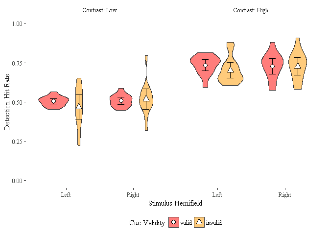

Behavioral data analyses
================

Introduction
============

This file documents and presents the analysis and code used to produce the behavioral results presented in Section 3.1 of the manuscript as well as the plots of Figure 1.

``` r
# Load session data
all_subject_sessions <- read.table(here::here("data/subjectBlockData.csv"), header=TRUE, sep=";")

subject_data_dirs<-list.dirs(here::here("data/behav"), recursive = FALSE)

# Import and pre-process all data
for (subject_dir in subject_data_dirs){
  
  subject_data<-summarise_subject_behav_data(subject_dir,all_subject_sessions) 
  subject_nb<-strsplit(subject_dir, "/")[[1]][6]
  
  nbTrialsHemifield<-compute_nb_trials_per_condition(subject_dir,all_subject_sessions) 
  nbTrialsHemifield$subject_nb<-subject_nb
  
  behav_data_temp<-subject_data$all_data
  behav_data_temp$subject_nb<-subject_nb
  
  falseAlarm_data_temp<-data.frame(subject_data$falseAlarm,subject_nb)
  
  if (!exists('behav_data')){
    behav_data<-behav_data_temp
    falseAlarm_data<-falseAlarm_data_temp
    rm(behav_data_temp,falseAlarm_data_temp)
  }else
  {
    behav_data<-rbind(behav_data,behav_data_temp)
    falseAlarm_data<-rbind(falseAlarm_data,falseAlarm_data_temp)
    rm(behav_data_temp,falseAlarm_data_temp)
  }
  
} 

behav_data$contrast<-factor(behav_data$contrast, levels = c("Low", "High"))
behav_data<-droplevels(behav_data)

behav_data<-behav_data%>%
  mutate(stimHemifield=ifelse((cueValidity == "valid" & cuedHemifield == "left") | 
                              (cueValidity == "invalid" & cuedHemifield == "right"),
                              "Left","Right"))%>%
  rename(Contrast=contrast)

falseAlarm_data <- falseAlarm_data %>% rename(false_alarm_rate = mean.hitRate.)
```

False alarm rate
================

We first display the per-subjet false alarm rates. Low alarm rates ensure that participants were in fact carrying out the task properly and not merely responding randomly. This is critical since the low contrast condition was calibrated for a 50% detection rate.

``` r
falseAlarm_data$trial_type<-"catch"
false_alarm_plot<-ggplot(data=falseAlarm_data, 
                         aes(x=trial_type,y=false_alarm_rate)) +
  geom_jitter(width=0.05, shape=1)+
  theme_classic() + 
  scale_y_continuous(breaks=seq(0,.15,.02)) + ylim(0,.15) +
  theme(axis.title.x=element_blank(),
        axis.text.x = element_blank(),
        axis.ticks.x = element_blank()) +
  ylab("False Alarm Rate") 

  
false_alarm_plot
```


Stimulus detection data
=======================

In the low contrast, stimulus detection was around the calibrated detection threshold of 0.5. In the high contrast, stimulus detection was at ceiling.

``` r
detection_data_summary<-behav_data%>%
  group_by(stimHemifield,cueValidity,Contrast) %>%
  summarise(sd = sd(hitRate_det),
            hitRate_det = mean(hitRate_det),
            n = n()) %>%
  mutate(se = sd / sqrt(n),
         ci = qt(1 - (0.05 / 2), n - 1) * se)

pd <- position_dodge(width = 0.75)


detection_Plot<-ggplot(data=behav_data , aes(x=stimHemifield , y=hitRate_det))+ 
  geom_violin(aes(fill=cueValidity),position = pd, alpha=0.5) +
  geom_errorbar(data=detection_data_summary ,
                aes(ymin=hitRate_det-ci,ymax=hitRate_det+ci,group=cueValidity),
                position = pd, 
                width = 0.2) +        # Large points
  scale_shape_manual(values=c(21,24), 
                     name="Cue Validity") +
  geom_point(data=detection_data_summary  , position=pd , size=3,
             fill="white", aes(shape=cueValidity) ) +
  facet_grid(. ~ Contrast, labeller = label_both) + 
  theme_tufte() + 
  scale_fill_ucscgb(name="Cue Validity") +
  scale_y_continuous(breaks=seq(0,1,.25)) + ylim(0,1) +
  theme(legend.position="bottom") +
  xlab("Stimulus Hemifield") + 
  ylab("Detection Hit Rate")
detection_Plot
```


To investigate the role of attention on stimulus detection, we ran a repeated-measures 2x2 ANOVA with Cue Validity and Stimulus Hemifield as factors. We first logit transformed the proportional hit rate to normalize the distribution.

``` r
hitRate_det_data<-behav_data%>%
  filter(Contrast=="Low")%>%
  select(hitRate_det, cueValidity,stimHemifield,subject_nb) %>%
  mutate(hitRate_det_trans=qlogis(hitRate_det))

hitRate_det_ANOVA <- ezANOVA(hitRate_det_data, dv=hitRate_det_trans, 
                             wid=subject_nb, 
                             within=.(cueValidity, stimHemifield),
                             detailed=TRUE)
hitRate_det_ANOVA$ANOVA
```

    ##                      Effect DFn DFd        SSn        SSd           F
    ## 1               (Intercept)   1  12 3.76690390 39.3345344  1.14918983
    ## 2               cueValidity   1  12 7.28674056  1.1205352 78.03492889
    ## 3             stimHemifield   1  12 0.01771366  1.8918091  0.11236016
    ## 4 cueValidity:stimHemifield   1  12 0.00217317  0.3069866  0.08494846
    ##              p p<.05          ges
    ## 1 3.048052e-01       8.114695e-02
    ## 2 1.343789e-06     * 1.459081e-01
    ## 3 7.432600e-01       4.151162e-04
    ## 4 7.756770e-01       5.094636e-05

``` r
# apa(hitRate_det_ANOVA,  format = "rmarkdown", print = TRUE)
```

Stimulus discrimination data
============================

In the low contrast, stimulus discrimination was at chance level. In the high contrast, stimulus discrimination was around the calibrated detection threshold of 0.5.

``` r
discrimination_data_summary<-behav_data%>%
  group_by(stimHemifield,cueValidity,Contrast) %>%
  summarise(sd = sd(hitRate_disc),
            hitRate_disc = mean(hitRate_disc),
            n = n()) %>%
  mutate(se = sd / sqrt(n),
         ci = qt(1 - (0.05 / 2), n - 1) * se)

pd <- position_dodge(width = 0.75)


discrimination_plot<-ggplot(data=behav_data , aes(x=stimHemifield , y=hitRate_disc))+ 
  geom_violin(aes(fill=cueValidity),position = pd, alpha=0.5) +
  geom_errorbar(data=discrimination_data_summary ,
                aes(ymin=hitRate_disc-ci,ymax=hitRate_disc+ci,group=cueValidity),
                position = pd, 
                width = 0.2) +        # Large points
  scale_shape_manual(values=c(21,24), 
                     name="Cue Validity") +
  geom_point(data=discrimination_data_summary  , position=pd , size=3,
             fill="white", aes(shape=cueValidity) ) +
  facet_grid(. ~ Contrast, labeller = label_both) + 
  theme_tufte() + 
  scale_fill_ucscgb(name="Cue Validity") +
  scale_y_continuous(breaks=seq(0,1,.25)) + ylim(0,1) +
  theme(legend.position="bottom") +
  xlab("Stimulus Hemifield") + 
  ylab("Detection Hit Rate")
discrimination_plot
```



To investigate the role of attention on stimulus discrimination, we ran a repeated-measures 2x2 ANOVA with Cue Validity and Stimulus Hemifield as factors. As performance for low contrast stimuli was at chance level, we only analyzed high contrast data. We first logit transformed the proportional hit rate to normalize the distribution.

``` r
hitRate_disc_data<-behav_data%>%
  filter(Contrast=="High")%>%
  select(hitRate_disc, cueValidity,stimHemifield,subject_nb) %>%
  mutate(hitRate_disc_trans=qlogis(hitRate_disc))

hitRate_disc_ANOVA <- ezANOVA(hitRate_disc_data, dv=hitRate_disc_trans, 
                             wid=subject_nb, 
                             within=.(cueValidity, stimHemifield),
                             detailed=TRUE)
hitRate_disc_ANOVA$ANOVA
```

    ##                      Effect DFn DFd         SSn       SSd          F
    ## 1               (Intercept)   1  12 51.85893293 7.5319411 82.6224197
    ## 2               cueValidity   1  12  0.05356202 0.6439124  0.9981858
    ## 3             stimHemifield   1  12  0.04444049 0.6698099  0.7961749
    ## 4 cueValidity:stimHemifield   1  12  0.07025159 0.5444388  1.5484185
    ##              p p<.05         ges
    ## 1 9.941994e-07     * 0.846689795
    ## 2 3.374708e-01       0.005671741
    ## 3 3.897818e-01       0.004710402
    ## 4 2.371256e-01       0.007425895

``` r
# apa(hitRate_disc_ANOVA,  format = "rmarkdown", print = TRUE)
```

Reaction times analyses
=======================

``` r
RT_data_summary<-behav_data%>%
  group_by(stimHemifield,cueValidity,Contrast) %>%
  summarise(sd = sd(responseRT),
            responseRT = mean(responseRT),
            n = n()) %>%
  mutate(se = sd / sqrt(n),
         ci = qt(1 - (0.05 / 2), n - 1) * se)

pd <- position_dodge(width = 0.75)


discrimination_plot<-ggplot(data=behav_data , aes(x=stimHemifield , y=responseRT))+ 
  geom_violin(aes(fill=cueValidity),position = pd, alpha=0.5) +
  geom_errorbar(data=RT_data_summary ,
                aes(ymin=responseRT-ci,ymax=responseRT+ci,group=cueValidity),
                position = pd, 
                width = 0.2) +        # Large points
  scale_shape_manual(values=c(21,24), 
                     name="Cue Validity") +
  geom_point(data=RT_data_summary  , position=pd , size=3,
             fill="white", aes(shape=cueValidity) ) +
  facet_grid(. ~ Contrast, labeller = label_both) + 
  theme_tufte() + 
  scale_fill_ucscgb(name="Cue Validity") +
  theme(legend.position="bottom") +
  xlab("Stimulus Hemifield") + 
  ylab("Detection Hit Rate")
discrimination_plot
```


We analyzed the RT data in two separate ANOVAs for low and high contrast data.

Low contrast condition
----------------------

``` r
RT_low_data<-behav_data%>%
  filter(Contrast=="Low")%>%
  select(responseRT, cueValidity,stimHemifield,subject_nb) 

RT_low_ANOVA <- ezANOVA(RT_low_data, dv=responseRT, 
                             wid=subject_nb, 
                             within=.(cueValidity, stimHemifield),
                             detailed=TRUE)
RT_low_ANOVA$ANOVA
```

    ##                      Effect DFn DFd          SSn        SSd            F
    ## 1               (Intercept)   1  12 5.135459e+01 1.02197811 6.030023e+02
    ## 2               cueValidity   1  12 7.267262e-02 0.05902151 1.477548e+01
    ## 3             stimHemifield   1  12 3.691513e-06 0.05935397 7.463386e-04
    ## 4 cueValidity:stimHemifield   1  12 1.042653e-04 0.04756163 2.630658e-02
    ##              p p<.05          ges
    ## 1 1.255459e-11     * 9.773913e-01
    ## 2 2.335919e-03     * 5.764979e-02
    ## 3 9.786542e-01       3.107546e-06
    ## 4 8.738529e-01       8.776397e-05

``` r
# apa(RT_low_ANOVA,  format = "rmarkdown", print = TRUE)
```

Low contrast condition
----------------------

``` r
RT_high_data<-behav_data%>%
  filter(Contrast=="High")%>%
  select(responseRT, cueValidity,stimHemifield,subject_nb) 

RT_high_ANOVA <- ezANOVA(RT_high_data, dv=responseRT, 
                             wid=subject_nb, 
                             within=.(cueValidity, stimHemifield),
                             detailed=TRUE)
RT_high_ANOVA$ANOVA
```

    ##                      Effect DFn DFd          SSn        SSd            F
    ## 1               (Intercept)   1  12 3.986510e+01 0.34071414 1404.0544400
    ## 2               cueValidity   1  12 2.399600e-02 0.02020395   14.2522637
    ## 3             stimHemifield   1  12 2.136459e-04 0.02462533    0.1041103
    ## 4 cueValidity:stimHemifield   1  12 8.798741e-05 0.00302888    0.3485938
    ##              p p<.05          ges
    ## 1 8.384999e-14     * 0.9903469106
    ## 2 2.646527e-03     * 0.0581624969
    ## 3 7.525043e-01       0.0005495207
    ## 4 5.658636e-01       0.0002263864

``` r
# apa(RT_high_ANOVA,  format = "rmarkdown", print = TRUE)
```
