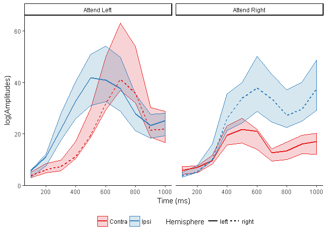
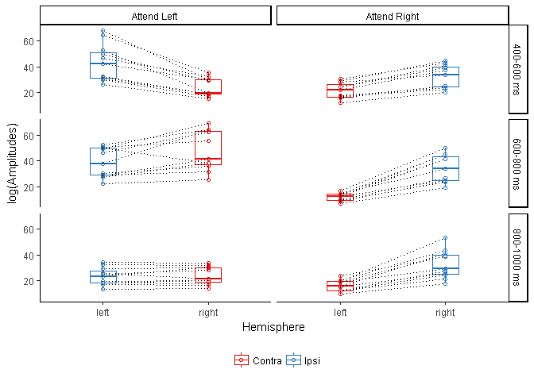

Lateralization of phase-synchrony
================

Introduction
------------

This file documents and presents the analysis and code used to produce results relating to the lateralization of high-alpha synchrony (operationalized as graph strength) presented in Section 3.6 of the manuscript as well as the plots of Figure 5.

We plot the graph strength as the sum of the baseline corrected wPLIs for the high-alpha frequency bands (i.e., between 11-13 Hz). wPLI values are summed across individual adjacency matrices which are generated by masking the raw wPLI matrices by the group statistical mask for each time-window.

Alpha phase-synchronization strength is different between ipsi and contralateral visual cortex
----------------------------------------------------------------------------------------------

We first plot the data from cue-onset (0 ms) up to a second after cue-onset. We plot the median value across subjects as well as the 25% and 75% quantile to give an overview of the data variability across participants.

``` r
# Read parcel names
parcel_names<- read.table(here::here("data", "vertexNames.csv"), header=TRUE, sep=';')
names(parcel_names)<-c('parcel_1', 'index')

# We first load and compute Graoh Strength for the attend left condition
attendedHemifield<-"Attend_Left_"

# List attend left adjacency matrices files
file_list<-list.files(here::here("data", "adj_matrices"), 
                      pattern=paste(attendedHemifield,"*",sep="."), 
                      recursive=TRUE, full.names=TRUE)


attend_left_data <- compute_hemispheric_graph_strength(file_list, parcel_names, 
                                                       attendedHemifield) 
attend_left_data$attention<-"Attend Left"
# We first load and compute Graoh Strength for the attend right condition

attendedHemifield<-"Attend_Right_"  

file_list<-list.files(here::here("data", "adj_matrices"), 
                      pattern=paste(attendedHemifield,"*",sep="."), 
                      recursive=TRUE, full.names=TRUE)

attend_right_data <- compute_hemispheric_graph_strength(file_list, parcel_names, 
                                            attendedHemifield) 
attend_right_data$attention<-"Attend Right"

# Combine data, 
# add a ipsi/contra variable
# remove unused TW and participants
GS_synch_data<-bind_rows(attend_left_data, attend_right_data) %>%
  gather(hemisphere,graph_strength,-TW, -subjectNb, -attention) %>%
  mutate(hemi_type=if_else(str_detect(attention,regex(hemisphere,ignore_case=TRUE)), "Ipsi", "Contra")) %>%
  filter(subjectNb!='S03' & subjectNb!='S11' & subjectNb!='S09')
```



Statistical testing
-------------------

In order to reduce the number of statistical comparisons, we average values within the 200 ms time-windows used throughout the manuscript. We run a statistical comparison for each time-window and attend condition and correct for multiple comps (6 conditions) using Holms Bonferroni corrections

We use the Wilcowon signed-rank test.

``` r
graph_strength_bin_plot<-ggplot(data=GS_synch_data_stats , 
                                 aes(x=hemisphere , y=graph_strength)) +
  geom_boxplot( aes(color=hemi_type), width=0.25) +
  geom_point(aes(color=hemi_type), shape=1) +
  geom_line(aes(group=subjectNb), linetype=3) +
  scale_colour_brewer( type = "seq", palette = 'Set1', direction = 1, name="") +
  facet_grid(TW_Bin ~ attention) +
  theme_classic() + 
  theme(legend.position="bottom") +
  xlab("Hemisphere") + 
  ylab("log(Amplitudes)")
graph_strength_bin_plot
```



``` r
# Apply Wilcoxon signed-rank test on difference between Ipsi and Contra
# for each time-window and attend condition
stats_results <- GS_synch_data_stats %>%
  select(-hemisphere) %>%
  spread(hemi_type,graph_strength) %>%
  mutate(diff=Contra-Ipsi) %>%
  group_by(attention,TW_Bin) %>%
  do(tidy(wilcox.test(.$diff))) 

stats_results<-bind_cols(stats_results,
                         data.frame(p_val_corr=p.adjust(stats_results$p.value,
                                                        method = "holm"))) %>%
  select(-method, -alternative)
```

| attention    | TW\_Bin     |  statistic|    p.value|  p\_val\_corr|
|:-------------|:------------|----------:|----------:|-------------:|
| Attend Left  | 400-600 ms  |          0|  0.0009766|     0.0058594|
| Attend Left  | 600-800 ms  |         59|  0.0185547|     0.0371094|
| Attend Left  | 800-1000 ms |         40|  0.5771484|     0.5771484|
| Attend Right | 400-600 ms  |          0|  0.0009766|     0.0058594|
| Attend Right | 600-800 ms  |          0|  0.0009766|     0.0058594|
| Attend Right | 800-1000 ms |          0|  0.0009766|     0.0058594|
