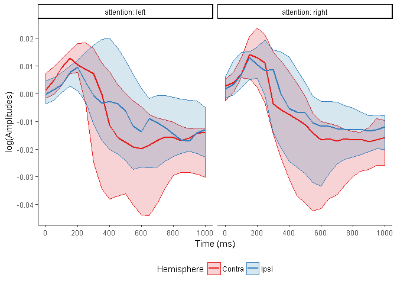
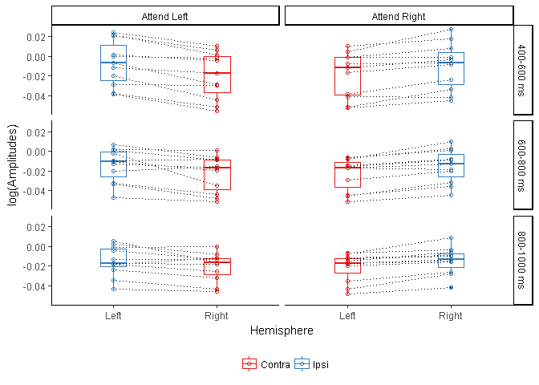

Lateralization of phase-synchrony and amplitudes
================

This file documents and presents the analysis and code used to produce results relating to the lateralization of amplitude suppression presented in Section 3.6 of the manuscript as well as the plots of Figure 5.

The goal here is to produce a plot showing that our data replicate the classic result of having more alpha suppression in the contralateral visual cortex than in the ipsilateisual cortex during visuospatial attention. ral v Here we plot the log of the baseline corrected amplitudes for the low alpha frequency bands (i.e., between 6-9 Hz) which were extracted for each participant from GDM. Amplitude modulations compared to baseline are averaged across the entire visual cortex as defined by the morphing with the yeo parcellation.

Amplitude suppression is different between ipsi and contralateral visual cortex
-------------------------------------------------------------------------------

We first plot the data from cue-onset (0 ms) up to a second after cue-onset. We plot the median value across subjects as well as the 25% and 75% quantile to give an overview of the data variability across participants.



Statistical testing
-------------------

In order to reduce the number of statistical comparisons, we average values within the 200 ms time-windows used throughout the manuscript. We run a statistical comparison for each time-window and attend condition and correct for multiple comps (6 conditions) using Holms Bonferroni corrections

We notice that for the third time window in attend left condition, the data is very skewed, and in different directions for each condition, violating the assumptions of the wilcoxon paired test. We therefore carry out a simple sign test for all conditions and time-windows in order to have comparable power and p-values across all comparisons.

``` r
visualCortexAmpData_Plot<-ggplot(data=visual_system_amplitude_data_stats , 
                                 aes(x=hemisphere , y=logAmp)) +
  geom_boxplot( aes(color=hemi_type), width=0.25) +
  geom_point(aes(color=hemi_type), shape=1) +
  geom_line(aes(group=subjectNb), linetype=3) +
  scale_colour_brewer( type = "seq", palette = 'Set1', direction = 1, name="") +
  facet_grid(TW_Bin ~ condition) +
  theme_classic() + 
  theme(legend.position="bottom") +
  xlab("Hemisphere") + 
  ylab("log(Amplitudes)")
visualCortexAmpData_Plot
```



``` r
# Code own sign-test to have simple to handle outputs
compute_sign_test<-function(x){
  n <-sum((x)!=0)
  T <- sum(x<0)
  S <- n - T 
  p_value<-2*min(1-pbinom(T-1,n,0.5),pbinom(T,n,0.5))
  data.frame(n=n,S=S,p_value=p_value)}

# Apply sign-test on difference between Ipsi and Contra
# for each time-window and attend condition
stats_results <- visual_system_amplitude_data_stats %>%
  select(-hemisphere) %>%
  spread(hemi_type,logAmp) %>%
  mutate(diff=Contra-Ipsi) %>%
  group_by(condition,TW_Bin) %>%
  do(compute_sign_test(.$diff)) 

stats_results<-bind_cols(stats_results,data.frame(p_val_corr=p.adjust(stats_results$p_value, method = "holm")))
# pValue=c(0.0009766, 0.01172, 0.06543,0.01172, 0.2266, 0.0009766 )
#Extract and Correct pValues
# signTestResults<-data.frame(signTestResults$TW_Bin, signTestResults$condition,S,pValue,p.adjust(pValue, method = "holm"))
# names(signTestResults)<-c( 'TW_Bin'  , 'condition',  'S' , 'pValue', 'corrp')
```

| condition    | TW\_Bin     |    n|    S|   p\_value|  p\_val\_corr|
|:-------------|:------------|----:|----:|----------:|-------------:|
| Attend Left  | 400-600 ms  |   11|    0|  0.0009766|     0.0058594|
| Attend Left  | 600-800 ms  |   11|    2|  0.0654297|     0.1308594|
| Attend Left  | 800-1000 ms |   11|    3|  0.2265625|     0.2265625|
| Attend Right | 400-600 ms  |   11|    1|  0.0117188|     0.0468750|
| Attend Right | 600-800 ms  |   11|    1|  0.0117188|     0.0468750|
| Attend Right | 800-1000 ms |   11|    0|  0.0009766|     0.0058594|
