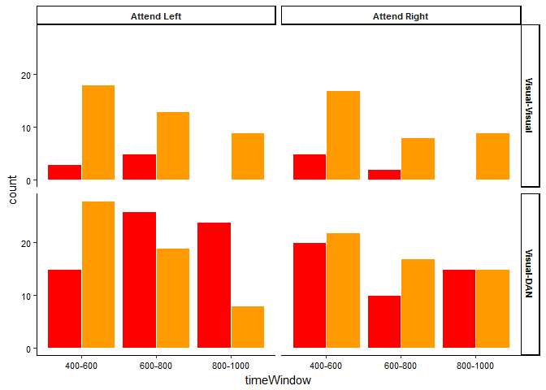
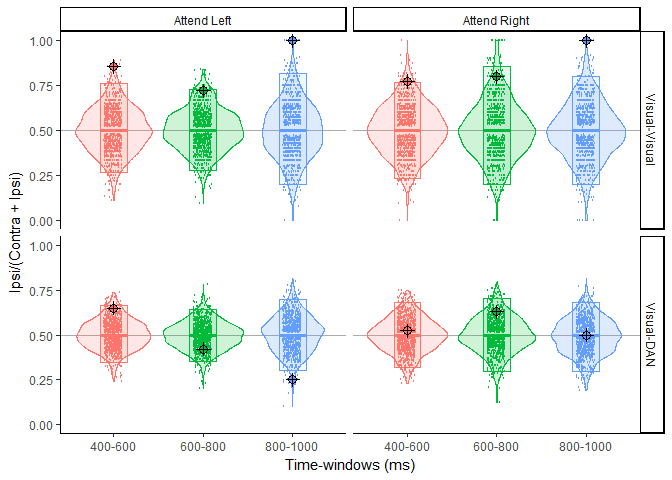

Lateralization of visual system connectivity
================

The goal of the project is to output the distribution of EVC values for the 6 graphs from the attention paper.

In order top make sure the results are as reproducible as possible, we do no not copy and paste ECV values from GGS but compute them directly from the adjacency matrices previously extracted from the LV code. The last part of this report shows that this code reports the same node EVC values as the LV code.

For each graph, the code loads the adjacency matrix, computes the node EVCs from it. From the adjacency matrix and then the node EVCs, it computes the edge EVCs for the existing edges as the sum of the edge's node's EVCs.

``` r
# Read file with system assignment for each parcel
system_assignments<-read.table(here::here("data","parcel_system_assignments.csv"), 
                               header=FALSE, sep=";")
system_assignments<-select(system_assignments,V1,V4)
names(system_assignments)<-c("system","parcel_names")

# Read parcel order used in graph files
parcel_list<-read.table(here::here("data","parcel_names.csv"), header=TRUE,sep=";")

# List graph files to be processed
fileList<-list.files(here::here("data","graphs"), 
                      recursive=TRUE, full.names=TRUE)


#For each graph, read file
# Count number of connections in left and right visual systems
for (file in fileList)
{
  data<-read.table(file,sep=";")
  
  tempconnection_nb<-count_visual_connections(data,
                                             system_assignments,
                                             parcel_list) 
    
  tempconnection_nb$attendCondition<-strsplit(strsplit(file,"-Base_")[[1]][1],"graphs/")[[1]][2]
  tempconnection_nb$timeWindow<-strsplit(strsplit(file,"-Base_")[[1]][2],"_wPLI")[[1]][1]
  
  if(!exists("connection_nb")){
    connection_nb<-tempconnection_nb
  }else{
    connection_nb<-bind_rows(connection_nb,tempconnection_nb)
  }
  rm(tempconnection_nb)
}

# Restructure dataframe
# Original data
connection_nb <- connection_nb %>%
  gather(type,count,-attendCondition,-timeWindow) %>% 
  mutate(connectionType=ifelse(grepl("within",type),"Visual-Visual","Visual-DAN")) %>%
  mutate(hemifield=ifelse((grepl("left",type) & attendCondition=="Left") | 
                          (grepl("right",type) & attendCondition=="Right"),
                                                                 "Ipsi","Contra")) %>%
  mutate(connectionType=factor(connectionType, levels = c("Visual-Visual", "Visual-DAN"))) %>%
  mutate(attendCondition=ifelse(attendCondition=="Left","Attend Left", "Attend Right"))

# Plot connection count

plot<-ggplot(data=connection_nb, aes(x=timeWindow,y=count,fill=hemifield)) +
  geom_col(position="dodge",color="white") + 
  facet_grid(connectionType~attendCondition) +
  theme_classic() +          
  scale_fill_ucscgb() +
  #  scale_colour_brewer(palette="Set1")  +
  theme(legend.position="none",  axis.text=element_text(size = 8, color='black'),
        strip.text = element_text(size=8, face="bold"),
        panel.grid.major=  element_blank() ,
        panel.grid.minor=  element_blank() )

plot
```



We have now counted the number of connections within ipsi or contralateral visual cortex as well as between ipsi or contralateral visual cortex and bilateral DAN for each attend condition and time-window. We would now like test whether the lateralization of this count is stronger than would be explained by chance alone. To do so, we compute thedistribution of the number of connections within ipsi and contralateral visual cortex in the case of randomly shuffled graphs.For each graph (one per condition / time-window), we randomly shuffle edges within the adjacency matrix and compute the edge count in each system for this random graphs. We shuffle each matrix 1000 times to obtain the null-hypothesis distribution of edge counts.

``` r
# Set seed to make results reproducible.
set.seed(1254)

nbShuffles <- 1000

if (exists('shuffled_connection_nb')){rm(shuffled_connection_nb)}
for (file in fileList)
{
  #Read data matrix
  dataMatrix<-as.matrix(read.table(file,sep=";"),rownames.force = NA)
  
  #Extract upper Triangle as vector
  flatDataMatrix <- upperTriangle(dataMatrix)
  
  #Shuffle the data and recompute connection counts
  for(ishuffle in 1:nbShuffles){
   
    #initNewAdjMatrix
    resampDataMatrix<-matrix(data=0,nrow=nrow(dataMatrix),ncol=nrow(dataMatrix))
    
    #Shuffle connections
    resampFlatDataMatrix <- sample(flatDataMatrix)
    
    #Assign shuffled connections to upper triangle
    upperTriangle(resampDataMatrix)<-resampFlatDataMatrix
    
    #Play around with transposing to assign lower triangle
    resampDataMatrix<-t(resampDataMatrix)
    upperTriangle(resampDataMatrix)<-resampFlatDataMatrix
    resampDataMatrix<-t(resampDataMatrix)
    
    #Count connections for resampled data frame
    tempconnection_nb<-count_visual_connections(as.data.frame(resampDataMatrix),
                                               system_assignments,
                                               parcel_list) 
    
    tempconnection_nb$attendCondition<-strsplit(strsplit(file,"-Base_")[[1]][1],"graphs/")[[1]][2]
    tempconnection_nb$timeWindow<-strsplit(strsplit(file,"-Base_")[[1]][2],"_wPLI")[[1]][1]
    tempconnection_nb$ID<-ishuffle
      
    if(!exists("shuffled_connection_nb")){
      shuffled_connection_nb<-tempconnection_nb
    }else{
      shuffled_connection_nb<-bind_rows(shuffled_connection_nb,tempconnection_nb)
    }
  }
}  
```

To quantify the lateralization of connectivty, we compute a laterality index latIndex as latIndex=Ipsi/(Ipsi+Contra) where Ipsi and Contra are the number of connections for the corresponding hemisphere.

We then compute and plot for each attend condition and time-window, the laterality index for all shuffled graphs, its 0.025 and .975 confidence limits as well as its value for our original graphs.

``` r
# Restructure dataframe
#Shuffled data
shuffled_connection_nb<-shuffled_connection_nb %>%
  gather(type,count,-attendCondition,-timeWindow,-ID) %>% 
  mutate(connectionType=ifelse(grepl("within",type),"Visual-Visual","Visual-DAN")) %>%
  mutate(hemifield=ifelse((grepl("left",type) & attendCondition=="Left") | 
                          (grepl("right",type) & attendCondition=="Right"),
                                                                 "Ipsi","Contra")) %>%
  mutate(connectionType=factor(connectionType, levels = c("Visual-Visual", "Visual-DAN"))) %>%
  mutate(attendCondition=ifelse(attendCondition=="Left","Attend Left", "Attend Right"))
  
# Compute laterality indices
# Origina data
laterality_index_data<-connection_nb %>%
  select(-type)%>%
  spread(hemifield,count)%>%
  mutate(latIndex=Ipsi/(Ipsi+Contra))

# Resampled data
laterality_index_shuffled<-shuffled_connection_nb %>%
                  select(-type) %>%
                  spread(hemifield,count) %>%
                  mutate(latIndex=Ipsi/(Ipsi+Contra))

# Compute confidence limits 
laterality_index_quantiles<-laterality_index_shuffled %>% 
  group_by(timeWindow,attendCondition,connectionType) %>%
  summarise(percentile_25=quantile(latIndex, probs=0.025),
            percentile_5=quantile(latIndex, probs=0.5),
            percentile_975=quantile(latIndex, probs=0.975)) 


# Plot data

propDistribution<-ggplot(data=laterality_index_shuffled, 
                         aes(x=timeWindow, fill=timeWindow, color=timeWindow)) +
            geom_hline(yintercept=0.5,color="dark grey") +
            geom_crossbar(data= laterality_index_quantiles, 
                          aes(y=percentile_5, ymin = percentile_25, ymax = percentile_975),
                          width = 0.3, alpha=0.1) +          
            geom_violin(aes(y=latIndex), alpha=0.2) +   
            geom_jitter(aes(y=latIndex), shape=1,size=0.25,width=0.1) +
            geom_point(data=laterality_index_data,aes(y=latIndex), size=3,shape=21,color="black") +
            geom_point(data=laterality_index_data,aes(y=latIndex), size=3,shape=3,color="black") +
            facet_grid(connectionType~attendCondition) + 
            theme_classic() + 
            ylab("Ipsi/(Contra + Ipsi)") + 
            xlab("Time-windows (ms)") + 
            theme(legend.position = "none")


propDistribution
```



These data show that connectivity in the visual system is more lateralized than would be expected by chance in the first and third time-windows, regardless of the direction of attention. There are consistenly more connections in the ipsilateral than in the contralateral visual cortex. In contrast, there is no systematic lateralization of connectivity between the visual system and DAN.
